# CV-QKD中的时钟恢复
# 时钟恢复算法研究

经典的时钟恢复算法大概分成了两种，第一种是对数据进行数学计算类的，如平方恢复算法。第二种是对数据进行拟合类的算法，如插值时钟恢复算法。
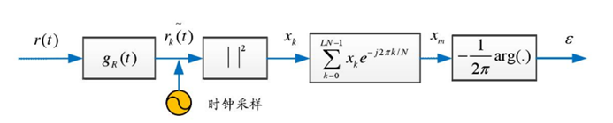

Fig 1.数字平方估计算法框图

对于数据平方时钟恢复算法，其根本上是将时钟不稳定的采样当成一种高频信号，即一种频率不同于载波的偏移量，通过对数据平方求模，通过复傅里叶系数来求出这部分的频率分量，计算出这部分时钟偏移所带来的频偏。
接收信号表示为：

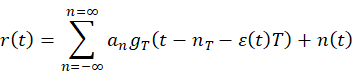

对信号进行模的平方计算:

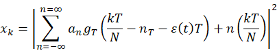

归一化处理后得到：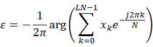

从信号中把导频信号分出来，对其进行上述过程，实际就是对复信号进行傅里叶变换，求其在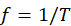时候的分量。

这种算法将时钟信号的偏移当成一种相位频偏来计算，在之前的文章中也看到过利用平方时钟恢复算法来补偿频偏的例子。但对于信噪比过低的信号，大部分从信号本身提取信息的算法都不太适用，信号太低，淹没在噪声中。

第二种时钟恢复算法就是**对波形的拟合**，如利用插值时钟恢复算法，插值算法可理解为过采样的一种方式，通过对现采样结果的判断估计出其他原本不存在采样点的地方拟合出新的采样值。或者采用其他的拟合方式，模拟出原本采样点不存在的地方的数值，减少由于时钟漂移带来的采样误差。

实验原理：
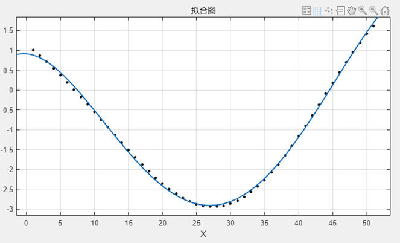

通过matlab自身的拟合函数，对每个脉冲的数据进行拟合，如上图所示。如：通过最小二乘拟合，可以得到n+1个参数，n代表调制参数。可以得到对应的拟合曲线的表达式。

如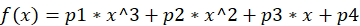，p1=-0.0002，p2=0.0025，p3=-0.0711，p4=3.7576。因此，在函数f(x)上选取同样位置的点，作为拟合结果进行输出。就完成了最简单的时钟恢复拟合算法。

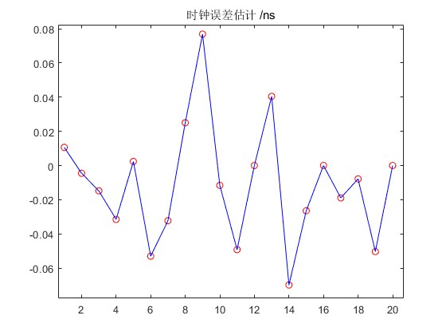

实验结果：
①    利用最小二乘估计时钟恢复
能够实现对所有脉冲的数据进行拟合，并求出时钟误差。
表 1. 不同最小二乘拟拟合阶数下的参数估计

|   |   |   |   |
|---|---|---|---|
||无|二阶LMS拟合|三阶LMS拟合|
|过量噪声|0.010565|0.001934|0.004684|
|透射率|0.117203|0.117227|0.116974|

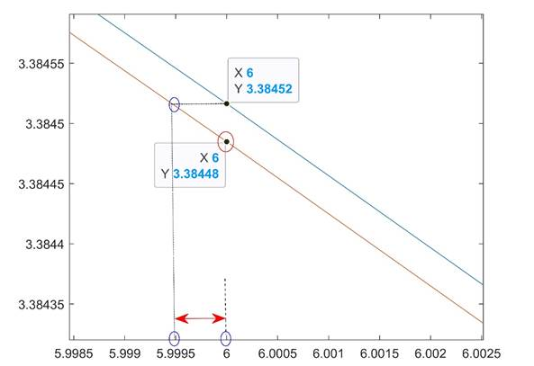

Fig 9. 最小二乘法拟合算法计算时钟误差

**利用基于机器学习的最小二乘估计时钟恢复**

利用机器学习模拟最小二乘拟合进行时钟恢复，将训练好的模型用于该组数据的所有数据进行测试，其中30W的数据用作训练，270W的数据用作测试。输入所有的结果，用于计算过量噪声和透射率。

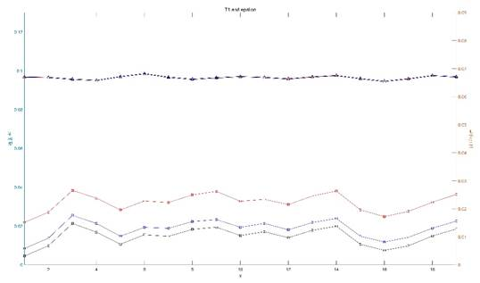

Fig 10. 最小二乘法拟合算法计算时钟误差

该组数据总共有20帧，前一帧用来训练，后面的结果都是测试集上得到的结果。在透射率估计0.97附近时，红线没有经过时钟恢复算法的过量噪声维持在0.0222附近。经过最小二乘恢复之后保持在0.0129附近，跟之前的结论一致。黑线代表通过机器学习来模拟最小二乘恢复时钟后得到的结果，与常规的最小二乘相比，过量噪声降低了0.003，在0.0101左右。能够得到结论**对于基于机器学习的最小二乘时钟恢复算法确实比常规的最小二乘算法有更好的效果**。

两个方案：1.自编码器；2.生成模型或序列到序列的模型

## 自编码器

已经实现了线性自编码器，卷积自编码器，LSTM的自编码器；实验结果可知线性自编码器的效果最好。

## 生成模型

两大类：直接在原自编码器模型上将输入长度改成5，输出长度是10,强行让其有生成能力。但效果不好
正在尝试生成模型VAE或GAN

VAE的结构如下图：来源于李宏毅老师上课PPT 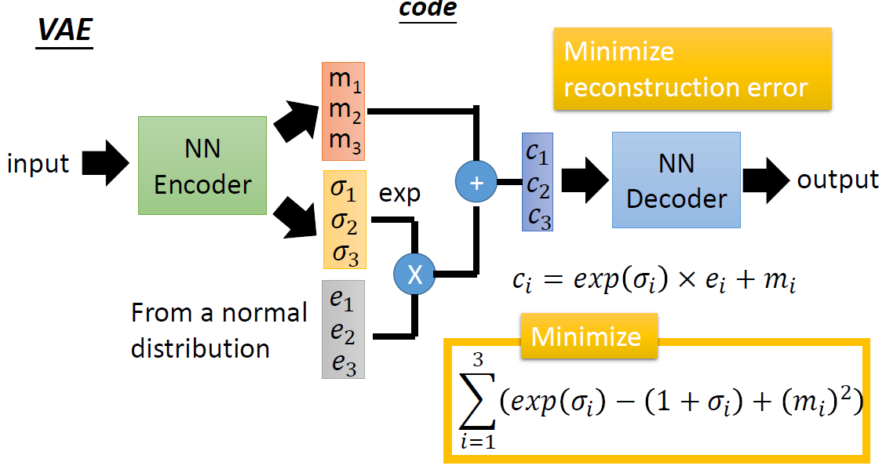

